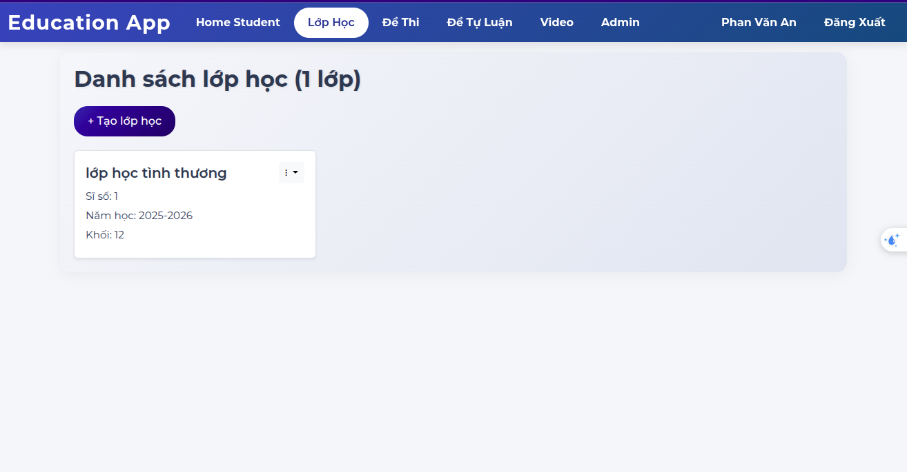
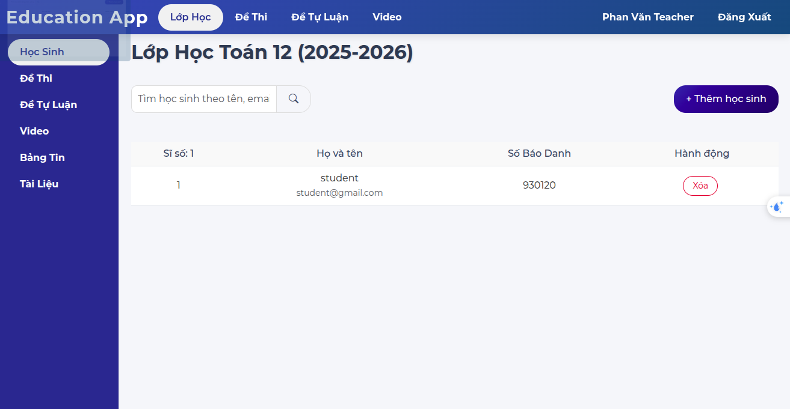
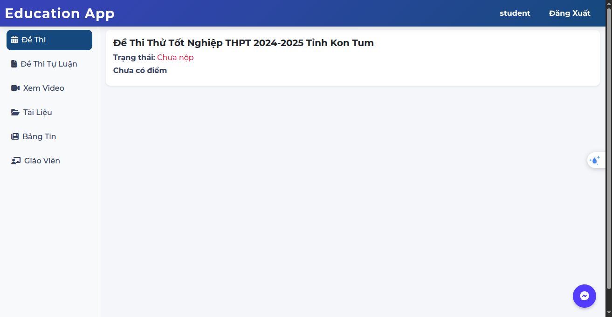

# Education Platform - hdp.io.vn

A full-featured education management system designed for real-world use, supporting teachers, students, and admins. Built for production with Docker Compose, Express.js, MongoDB, and Nginx, secured with Let's Encrypt SSL, and deployed at [hdp.io.vn](https://hdp.io.vn).

## 📸 Platform Preview

Explore the platform’s intuitive interfaces for admins, teachers, and students. Below are screenshots showcasing key functionalities:

| **Admin Dashboard**                      | **Teacher Interface**                                     | **Student Portal**                            |
| ---------------------------------------- | --------------------------------------------------------- | --------------------------------------------- |
| Manage users and roles with ease.        | Create classes, assign tests, and track student progress. | Take tests, submit essays, and view progress. |
|  |               |      |

---

## 🚀 Key Features

### 🔒 Authentication & Security

- **JWT Authentication** for secure API access.
- **Password Reset via OTP**: Users receive a one-time password by email to reset their password.
- **Role-based Access Control**: Supports `teacher`, `student`, and `admin` roles.

### 👩‍🏫 Teacher Features

- **Class Management**: Create classes, add students by email, and manage rosters.
- **Test Creation**: Build tests with multiple answer types (multiple choice, fill-in, etc.).
- **Essay Assignments**: Create essay tests; students upload their answers as files (PDF, images, DOCX, XLSX).
- **Video Requirements**: Assign videos that students must watch (with anti-skip/seek enforcement).
- **Assignment Distribution**: Assign tests, essays, and videos to specific classes.
- **Student Progress Tracking**: View student submissions, scores (auto-graded for tests), and completion status.
- **Class Folder**: Teachers can upload files (documents, images, resources) to any class they manage.

### 👨‍🎓 Student Features

- **Class Enrollment**: Automatically see classes when added by a teacher.
- **Take Tests**: Complete tests with instant backend scoring and feedback.
- **Essay Submission**: Upload files for essay assignments.
- **Watch Videos**: Complete video requirements (cannot skip/seek).
- **Progress Dashboard**: View scores, feedback, and submission status.
- **File In Class** can download files (essays, reports, etc.) directly to the class or specific assignments.

### 🛠️ Admin Features

- **User Management**: Search for users and set their roles (student, teacher, admin).

---

## 🏗️ Tech Stack

- **Backend**: Node.js, Express.js
- **Database**: MongoDB
- **Frontend**: EJS templates, Bootstrap, React (for some forms)
- **Reverse Proxy**: Nginx (serves static files, proxies API, handles SSL)
- **SSL**: Let's Encrypt (auto-renewal, secure HTTPS)
- **Containerization**: Docker Compose (multi-service: Express, MongoDB, Nginx, Certbot)
- **Domain**: [hdp.io.vn](https://hdp.io.vn)

---

## 🐳 Deployment & Architecture

- **Docker Compose** orchestrates all services:
  - `express`: Main application server (Node.js)
  - `mongodb`: Database
  - `nginx`: Reverse proxy, static file server, SSL termination
  - `certbot`: Automated SSL certificate management
- **Hot Configuration**: Easily update Nginx and SSL without downtime.
- **Production Ready**: Real users, real client, robust logging, and health checks.

---

## 🌟 Why This Project Stands Out

- **Real-world deployment**: Not just a demo—serving real users at a real domain.
- **Security best practices**: JWT, role-based access, SSL everywhere.
- **Full-stack skills**: Backend, frontend, DevOps, and cloud deployment.
- **Complex business logic**: Auto-grading, anti-cheat video, flexible assignment types.
- **Modern development workflow**: Dockerized, modular, and maintainable.

---

## 🏁 Getting Started

## 🧑‍🏫🧑‍🎓 Demo Accounts for Easy Testing

- **Test Accounts Provided**: I supply ready-to-use teacher and student accounts (username & password) so you can log in and explore all features directly on the live website.

- **Teacher Account**

  - **Username:** `teacher`
  - **Password:** `teacher`

- **Student Account**
  - **Username:** `student`
  - **Password:** `student`

Just go to [https://hdp.io.vn](https://hdp.io.vn), log in with the above credentials, and explore all the features from both teacher and student perspectives!

### 🏁 Quick Start Project

```sh
git clone https://github.com/ANPHANVAN/education
cd education
cp .env.example .env   # Fill in your secrets
cp .database.example .database   # create initial data
docker-compose up -d --build
```

**View website at [localhost:80](http://localhost:80)**

## 📜 License

This project is licensed under the [Apache 2.0 License](LICENSE) - see the [LICENSE](LICENSE) file for details.

## 👨‍💻 Author & Contact

- **Built by:** [Phan Văn An]
- **Contact:** [anphan.mainwork@gmail.com]
- **LinkedIn:** [linkedin.com/in/anphanvan/](https://www.linkedin.com/in/anphanvan/)
- **GitHub:** [github.com/ANPHANVAN](https://github.com/ANPHANVAN)
- **Location:** [Bình Tân, Hồ Chí Minh]
<!-- - **Portfolio:** [your-portfolio.com] *(optional, if you have one)* -->
